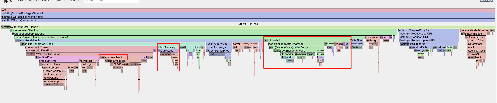

# Redis-ID-Generator


Redis-id-generator is a high-performance distributed globally unique ID Generator based on Redis developed using Golang.

Them roughly algorithm based on database, refer to [Meituan Leaf](https://tech.meituan.com/2017/04/21/mt-leaf.html)

The code is simple, simple to use, high performance, extensible, provides ID generation http service and library two ways to use.

- Use a ID generation service can reach 10w qps.
- Use as ID generation library can reach 100w qps.

[中文文档](docs/README_CN.md)

Redis-ID-Generator 是一款使用 Go 开发的，基于 Redis 的高性能分布式全局唯一 ID 生成器。

基于数据库号段算法实现，可参考 [美团 Leaf](https://tech.meituan.com/2017/04/21/mt-leaf.html)

代码简洁、使用简单、性能高、可扩展，提供了 ID生成http服务 和 库 两种使用方式。
- ID 生成服务可达 10w qps。
- 作为 ID 生成库使用可达 100w qps


## Function Introduction
Features:

1. Globally unique int64 data type id
2. The id is increasing in trend. The next id is not strictly guaranteed to be larger than the previous ID
3. The id is not continuous
4. http services and libraries are provided
5. Support the post-processing logic of custom id generation to achieve id formats that meet different requirements
    - For example, a region id is included to enable global multi-region deployment
6. Support changing the db type (Redis by default)


## Usage
### Use as a service
1. Download the executable file

- Get the latest version of the executable from Relaeses
- Decompress
 
```shell
wget https://github.com/allan-deng/redis-id-generator/releases/download/v0.1.0/idgensvr_v0.1.0.tar.gz
tar -xzvf idgensvr_v0.1.0.tar.gz
```

2. Start service

```shell
./idgensvr
```

3. Test function
```
curl 'http://127.0.0.1:8080/id?biztag=test'

{"ret":0,"msg":"succ","biztag":"test","id":31365922909934}
```

The service catalog is as follows:
```
.
├── config
│   └── conf.toml -- Service config file
├── idgen -> idgensvr_b2ca3d1_ddacd4631c08aa2decbf98393e308b49 -- Soft link
├── idgensvr_b2ca3d1_ddacd4631c08aa2decbf98393e308b49 -- Executable file
└── log -- Default log path
```


#### Service Config

```toml
[app]
ip = "0.0.0.0"
port = 8080
env = "debug" # When env is debug, net/pprof is started and listens on port 6060

[redis]
addr = "localhost:6379"
password = ""

[log]
level = "debug" # defalut: info. trace,debug,info,warn,error,fatal
output = "console" # file/console
filename = "log/idgen.log"
max_age = 7        # unit:day
rotation_time = 24 # uint: hour

[idgen]
default_step = 10000     # Default number of ids obtained from the database at a time
preload_retry_times = 3  # Maximum number of retries for preloading
preload_timeout = 3000   # Preload timeout
biztag_expire_time = 0   # Cached bizTag expiration time
```
> Note: The default number segment size must be set properly. It is recommended that the number segment size be equal to the number of assigned ids in 10 to 30 minutes

### Used as a library
```
go get github.com/allan-deng/redis-id-generator/pkg/idgen
```

```go
import "github.com/allan-deng/redis-id-generator/pkg/idgen"

func main() {
	client := redis.NewClient(&redis.Options{
		Addr:     addr,
		Password: pwd,
		DB:       0,
	})
	store := idgen.NewRedisIdStore(client)

	opts := make([]idgen.Option, 0)
	opts = append(opts, idgen.With2BytesRandomFilter())

	gen := idgen.NewIdGenrator(store, opts...)

    bizTag := "test"
    id, err := gen.GetId(context.Background(), bizTag)
}
```

#### Options
```go
// ---params---
// Cached bizTag expiration time
WithExpireTime(expireTime time.Duration)
// Preload timeout 
WithPreloadTimeout(timeout time.Duration)
//Maximum number of retries for preloading
WithPreloadRetryTimes(times int)
//Default number of ids obtained from the database at a time (number segment length)
WithStep(step int64)
// --- filter ---
// Specifies the post-processing filter logic after Id generation
WithIdFilter(filters []IdFilter)
// The last 16 bits of the generated id are filled in with random numbers
With2BytesRandomFilter()
```

## Performance
```shell
$ make bench
go test -benchmem -run=^$ -bench=^Benchmark  -benchtime=5s -cpu=1,2,4,8,16 github.com/allan-deng/redis-id-generator/pkg/idgen
goos: linux
goarch: amd64
pkg: github.com/allan-deng/redis-id-generator/pkg/idgen
cpu: AMD Ryzen 7 5700G with Radeon Graphics         
BenchmarkGetId          12784004               919.4 ns/op     517 B/op           5 allocs/op
BenchmarkGetId-2        20994384               804.7 ns/op     290 B/op           5 allocs/op
BenchmarkGetId-4        19969681               726.5 ns/op     301 B/op           5 allocs/op
BenchmarkGetId-8        17245339               606.6 ns/op     277 B/op           5 allocs/op
BenchmarkGetId-16       18317637               972.3 ns/op     296 B/op           5 allocs/op
PASS
```

### Used as a third-party library
- Service preloads ID segment and generates local allocation
- The larger the number length (step), the higher the performance
- Up to 100w qps or more


### Used as a service
- The performance depends on the httpserver performance and network bandwidth
- This service is implemented using fasthttp, which can reach more than 10w qps on a single machine

## Principle
### Key points of ID generation server

Globally unique ids are required to identify user orders and operations in the service system. In traditional simple services, db incr is used to generate unique ids. With the increasing number of requests, db has been unable to meet the requirements of higher id generation rate.

A globally unique ID generation service is required for this purpose


**Requirements for ID generation system:**
1. The ID is globally unique
2. High performance: Basic services take as little time as possible
3. Easy to use: Easy access out of the box
 

### Implementation principle
Optimize the way to obtain ids from the database one at a time. The service obtains a batch of ids (id number segments) from the db at a time and allocates them locally. After the local number segment is used up, obtain the next batch id from the db.

To improve performance, improve availability. The service preloads the next number segment. When the db is faulty, you can still obtain the number segment from the current number segment and the preloaded number segment.

### ID format
Default ID format:
- 1 bit - Indicates the reserved bit
- 47 bit - Generates a maximum of 1.4 trillion ids
- 16 bit - Specifies a random number that keeps the id discontinuous
```
			+-----------------------+
			|0|0000.......0000|0...0|
			+-----------------------+
1bit reserved  47bit incr id    16bit random
				1.4 trillion
```

You can implement IdFilter yourself to add the required business logic to the generated id

### Service architecture

Attention:
1. Services are stateless and can scale linearly
2. To improve service availability, deploy in multiple availability zones

## TODO
### Service performance optimization
1. Cache optimization of bizTag
    - The bizTag cache currently uses sync.Map. For this kind of read more and write less content, you can consider lower overhead data structure management

2. The return value is in json format, and deserialization consumes a lot of time.
    - Consider switching to a more efficient json library such as JSON-Interator
    - Consider other protocols with higher codec efficiency, such as protobuf

3. Use lock-free programming to optimize the performance of high concurrent id acquisition


