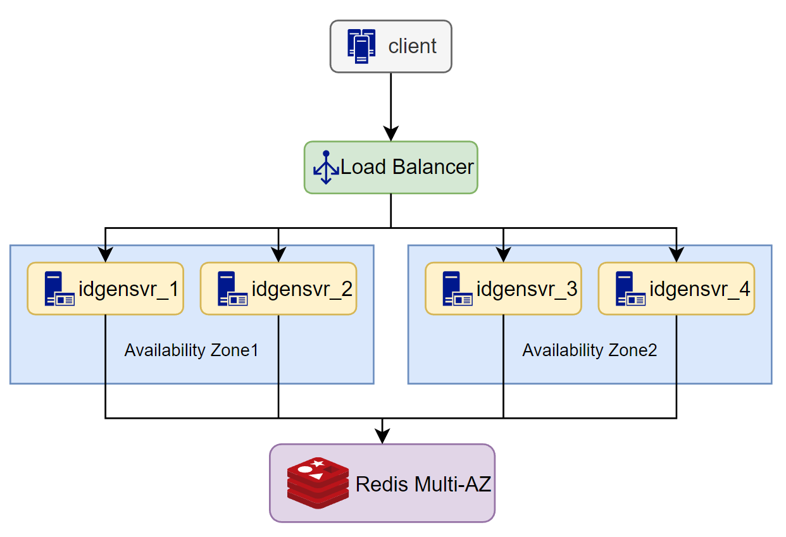
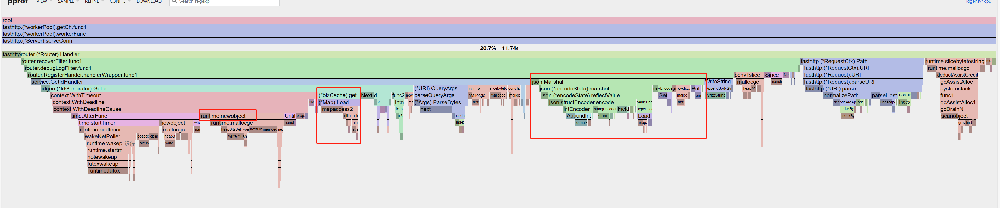

# Redis-ID-Generator


Redis-ID-Generator 是一款使用 Go 开发的，基于 Redis 的高性能分布式全局唯一 ID 生成器。

基于数据库号段算法实现，可参考 [美团 Leaf](https://tech.meituan.com/2017/04/21/mt-leaf.html)

代码简洁、使用简单、性能高、可扩展，提供了 ID生成http服务 和 库 两种使用方式。
- ID 生成服务可达 10w qps。
- 作为 ID 生成库使用可达 100w qps


## 简介

特点：
1. 全局唯一的 int64 数据类型的 id
2. 趋势递增的 id。不严格保证 下一个 id 一定比上一个大
3. id 非连续
4. 提供了 http 服务 和 库 两种使用方式
5. 支持自定义 id 生成的后处理逻辑，实现满足不同要求的 id 格式
    - 例如包含 区域 id ，实现全球多区域部署
6. 支持更换使用的 db 类型（默认使用 redis）

## 用法
### 作为'服务'使用
1. 下载可执行文件

- 从 Relaeses 中获取最新版本的可执行文件
- 解压
```shell
wget https://github.com/allan-deng/redis-id-generator/releases/download/v0.1.0/idgensvr_v0.1.0.tar.gz
tar -xzvf idgensvr_v0.1.0.tar.gz
```

2. 启动服务

```shell
./idgensvr
```

3. 测试功能
```
curl 'http://127.0.0.1:8080/id?biztag=test'

{"ret":0,"msg":"succ","biztag":"test","id":31365922909934}
```

服务目录如下：
```
.
├── config
│   └── conf.toml -- 服务配置文件
├── idgen -> idgensvr_b2ca3d1_ddacd4631c08aa2decbf98393e308b49 -- 软链
├── idgensvr_b2ca3d1_ddacd4631c08aa2decbf98393e308b49 -- 可执行文件
└── log -- 默认日志路径
```


#### 服务配置

```toml
[app]
ip = "0.0.0.0"
port = 8080
env = "debug" # 当 env 为 debug 时，会启动 net/pprof 并监听 6060 端口

[redis]
addr = "localhost:6379"
password = ""

[log]
level = "debug" # defalut: info. trace,debug,info,warn,error,fatal
output = "console" # file/console
filename = "log/idgen.log"
max_age = 7        # unit:day
rotation_time = 24 # uint: hour

[idgen]
default_step = 10000     # 默认的 一次从数据库中获取的 id 数量
preload_retry_times = 3  # 进行预加载的最大重试次数
preload_timeout = 3000   # 预加载超时时间
biztag_expire_time = 0   # 缓存的 bizTag 过期时间
```
> 注意：号段的默认大小需要合理设置，建议号段大小 约等于10~30分钟的 id 分配数量


### 作为'第三方库'使用
```
go get github.com/allan-deng/redis-id-generator/pkg/idgen
```

```go
import "github.com/allan-deng/redis-id-generator/pkg/idgen"

func main() {
	client := redis.NewClient(&redis.Options{
		Addr:     addr,
		Password: pwd,
		DB:       0,
	})
	store := idgen.NewRedisIdStore(client)

	opts := make([]idgen.Option, 0)
	opts = append(opts, idgen.With2BytesRandomFilter())

	gen := idgen.NewIdGenrator(store, opts...)

    bizTag := "test"
    id, err := gen.GetId(context.Background(), bizTag)
}
```

#### 可选配置
```go
// ---参数---
// 缓存的 bizTag 过期时间
WithExpireTime(expireTime time.Duration)
// 预加载超时时间
WithPreloadTimeout(timeout time.Duration)
//进行预加载的最大重试次数
WithPreloadRetryTimes(times int)
//默认的 一次从数据库中获取的 id 数量(号段长度)
WithStep(step int64)
// --- 过滤器 ---
// 指定 Id 生成后的后处理过滤器逻辑
WithIdFilter(filters []IdFilter)
// 生成的 id 最后 16 bit 使用随机数字填充
With2BytesRandomFilter()
```


## 性能
```shell
$ make bench
go test -benchmem -run=^$ -bench=^Benchmark  -benchtime=5s -cpu=1,2,4,8,16 github.com/allan-deng/redis-id-generator/pkg/idgen
goos: linux
goarch: amd64
pkg: github.com/allan-deng/redis-id-generator/pkg/idgen
cpu: AMD Ryzen 7 5700G with Radeon Graphics         
BenchmarkGetId          12784004               919.4 ns/op     517 B/op           5 allocs/op
BenchmarkGetId-2        20994384               804.7 ns/op     290 B/op           5 allocs/op
BenchmarkGetId-4        19969681               726.5 ns/op     301 B/op           5 allocs/op
BenchmarkGetId-8        17245339               606.6 ns/op     277 B/op           5 allocs/op
BenchmarkGetId-16       18317637               972.3 ns/op     296 B/op           5 allocs/op
PASS
```

### 作为第三方库使用
- 服务预加载 ID 段，本地分配生成
- 设置的 号段长度(step) 越大，性能越高
- 可达 100w qps 以上

### 作为服务使用
- 性能取决于 httpserver 的性能、网络带宽
- 本服务使用 fasthttp 实现，单机可达 10w qps 以上

## 原理
### ID 生成系统的要点
背景：
在业务系统中需要全局唯一的 id 标识用户的 订单、操作等。传统的简单服务中，使用 db 的 incr 实现唯一id的生成。随着 请求量的逐渐上升，db 已经无法满足更高的 id 生成速率的要求。
为此需要 全局唯一的 ID 生成服务

ID 生成系统的要求：
1. ID 全局唯一
2. 高性能: 基础服务尽可能耗时少
3. 简单易用: 开箱即用接入方便

### 实现原理

优化从 数据库中获取一次获取一个 id 的方式，服务一次从 db 中获取一批id（id号段），并在本地进行分配。本地的号段用完后再向 db 获取下一批 id.

为了提高性能，提高可用性。服务会预加载下一个号段。当 db 故障时，依然可以从当前号段 和 预加载的号段在中获取。

### ID 生成格式
默认的 ID 格式：
- 1 bit - 保留位
- 47 bit - 最多生成1.4万亿个id
- 16 bit - 随机数，保持 id 不连续
```
			+-----------------------+
			|0|0000.......0000|0...0|
			+-----------------------+
1bit reserved  47bit incr id    16bit random
				1.4 trillion
```

可以自行实现 IdFilter 在生成的 id 中增加所需的 业务逻辑

### 服务架构

注意：
1. 服务是无状态的，可以线性扩展
2. 为提高服务的可用性，请多可用区域部署

## TODO
### 服务性能优化
1. bizTag 的缓存优化
    - bizTag 缓存目前使用了 sync.Map 。对于这种读多写少的内容，可以考虑开销更低数据结构进行管理

2. 返回值为 json 格式，反序列化消耗了大量时间。
    - 可以考虑换用效率更高的 json 库，如 json-interator
    - 可以考虑其他编解码效率更高的协议，如 protobuf

3. 采用无锁编程，优化高并发获取id时的性能

